# random-UE5-project

Random university project created in Unreal Engine 5.6.1 (and C++). It features a wave-based survival system, melee combat mechanics, AI enemies, and a custom UI HUD. This repository is solely for a university assignment, but the project is named "VaultView" because this codebase will serve as the starting point for a separate, private project in the future.

[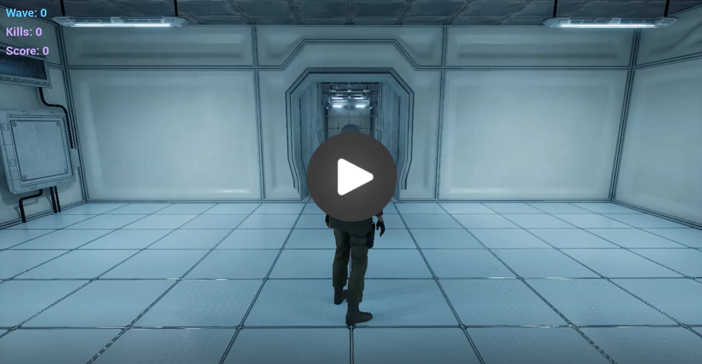](https://streamable.com/oicgym)
*▶ Click to watch gameplay*

## 🛠 Requirements
* **Unreal Engine 5** (version matching the `.uproject` file)
* **JetBrains Rider** (or Visual Studio)

## 🚀 How to Run
1. Clone the repository to your local drive.
2. Ensure you have all the necessary assets in the `Content/` folder.
3. Right-click on the `VaultView.uproject` file and select **Generate Visual Studio project files**.
4. Open the project in your IDE (e.g., `VaultView.sln` in JetBrains Rider), click **Build**, and then launch the project.

## ⚠️ Missing Assets Notice
Please note that certain licensed assets from the Unreal Engine Marketplace have been excluded from this repository for copyright reasons. These include:
- `ModularSciFiStation`
- `SciFi_BioLaboratory`
- `Adventure_Pack`
- `Assassin`

If you clone this project, the C++ code and Blueprints will still compile and work correctly, but you may see missing meshes and materials in the levels unless you own and add these asset packs to your `Content/` folder.

---
# Documentation

## 1. Overview
The objective of the game is to collect items that increase the player's score while navigating through a level. The player must fight through enemies and eventually reach the end of the level, managing their health points (HP) along the way.

The project also includes additional polish features beyond the mandatory requirements, such as a Wave System with teleportation and camera fades, multiple AI perception senses, advanced attack animations instead of simple overlap damage, and more. **Please note that the following chapter (Section 2) presents strictly the minimum requirements needed to achieve maximum points for the project.**

## 2. Implementation Details

### AActor / UObject
- **Player Character (`VaultViewCharacter.h` [L55-L59], `VaultViewCharacter.cpp` [whole file])**: Inherits from `ACharacter`. Features `UPROPERTY` variables for `AttackDamage`, and `Score` marked as `BlueprintReadOnly/EditAnywhere`.
- **Enemy AI (`VaultViewEnemy.h` [L70-L79], `VaultViewEnemy.cpp` [L47-L91])**: Inherits from `ACharacter` and uses an `AAIController` as the default controller. Deals damage to the player when their colliders begin to overlap, with continuous damage applied every 1s while overlapping.
- **Interfaces (`DamageableInterface.h` [whole file], `DamageableInterface.cpp` [whole file])**: An abstract C++ interface used for communication between systems, implementing `TakeDamage` functionality across both the character and the enemy.
- **Collectibles (`PickupActor.h` [whole file], `PickupActor.cpp` [whole file], `PickupData.h` [whole file], `PickupData.cpp` [whole file])**: Contains at least 1 collectible object that increases the Score value, and at least 2 collectible objects positively and negatively affecting the HP of the player (which enemies ignore).
- **Pointer Safety**: All `UObject` references utilize `TObjectPtr` with `UPROPERTY` to prevent garbage collection issues. No raw pointers are used.

### Widgets / UMG
- **HUD (`VaultViewHUDWidget.h` [whole file], `VaultViewHUDWidget.cpp` [whole file])**: A custom C++ class inheriting from `UUserWidget`. It displays the HP bar, wave counter, and enemy kill counter.
- **Event-Driven UI (`VaultViewHealthComponent.h` [L14-L15, L34-L44], `VaultViewHealthComponent.cpp` [L39-L51])**: HP and MaxHP variables are stored here. HP updates via event-driven binding using the `OnDamaged` delegate from the Health Component, completely avoiding property binding or Tick.
- **Death Screen**: A screen shown when HP is zero with a Restart option.
- **Screenshots**:
  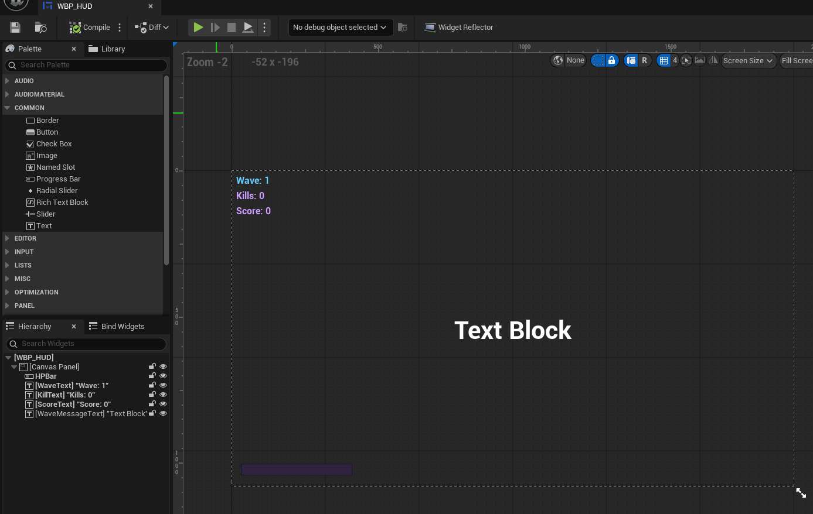
  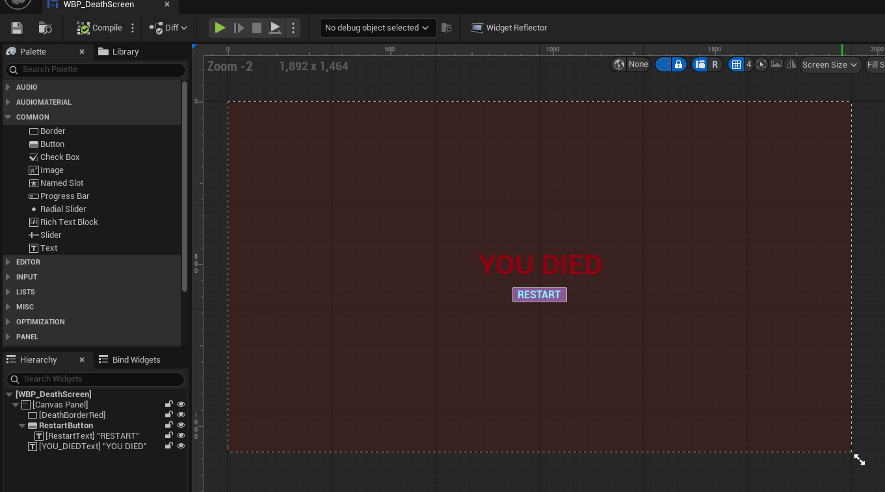

### AI and Behavior Trees
- **AI Controller (`VaultViewAIController.h` [whole file], `VaultViewAIController.cpp` [L15-L26, L32-L37])**: A custom controller setting up both the `UBehaviorTreeComponent` and `UBlackboardComponent`.
- **Perception Component**: Utilizes `UAIPerceptionComponent` with the Sight sense bound to `OnTargetPerceptionUpdated`, updating the Blackboard keys.
- **Behavior Tree**: The AI implements at least three states: Patrol (moves between waypoints), Combat (chases the player), and Search (looks for the player's last known location after losing sight).
- **Blackboard**: Uses keys named by convention: `TargetActor` (Object) and `LastKnownLocation` (Vector).
- **Screenshots**:
  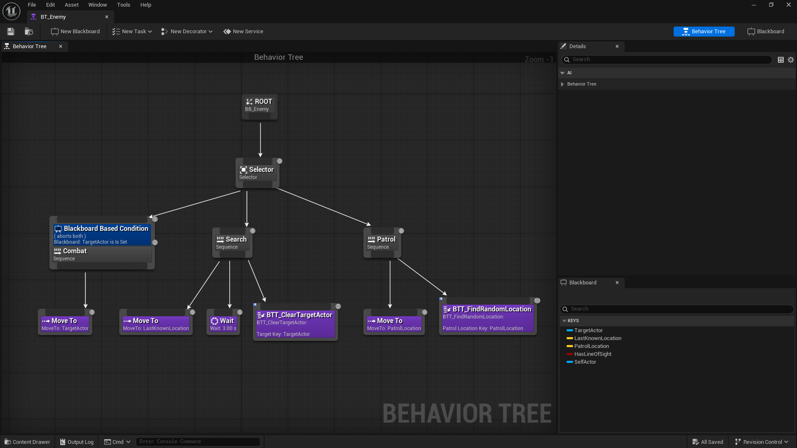
  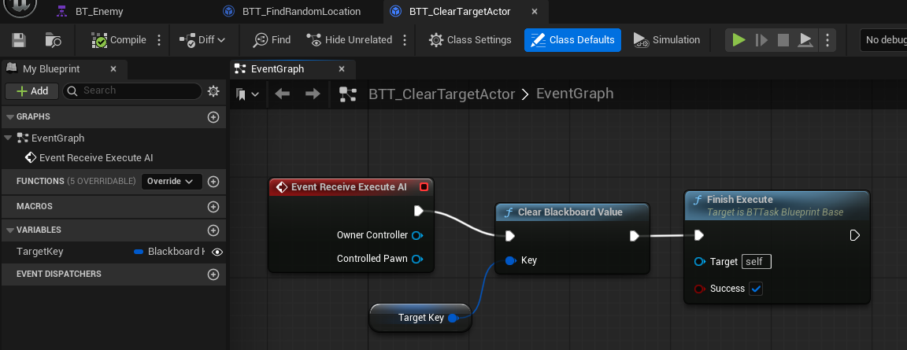
  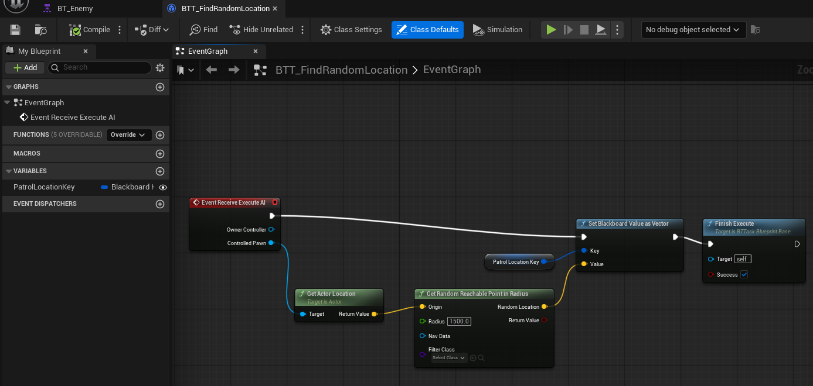

### Animation
- **Animation Blueprints**: Characters are animated using a properly configured State Machine.
- **BlendSpaces**: Idle/Walk/Run states are handled via a BlendSpace.
- **Jump Substates**: Jumping is implemented using 3 substates (Jump, Fall, Land).
- **Screenshots**:
  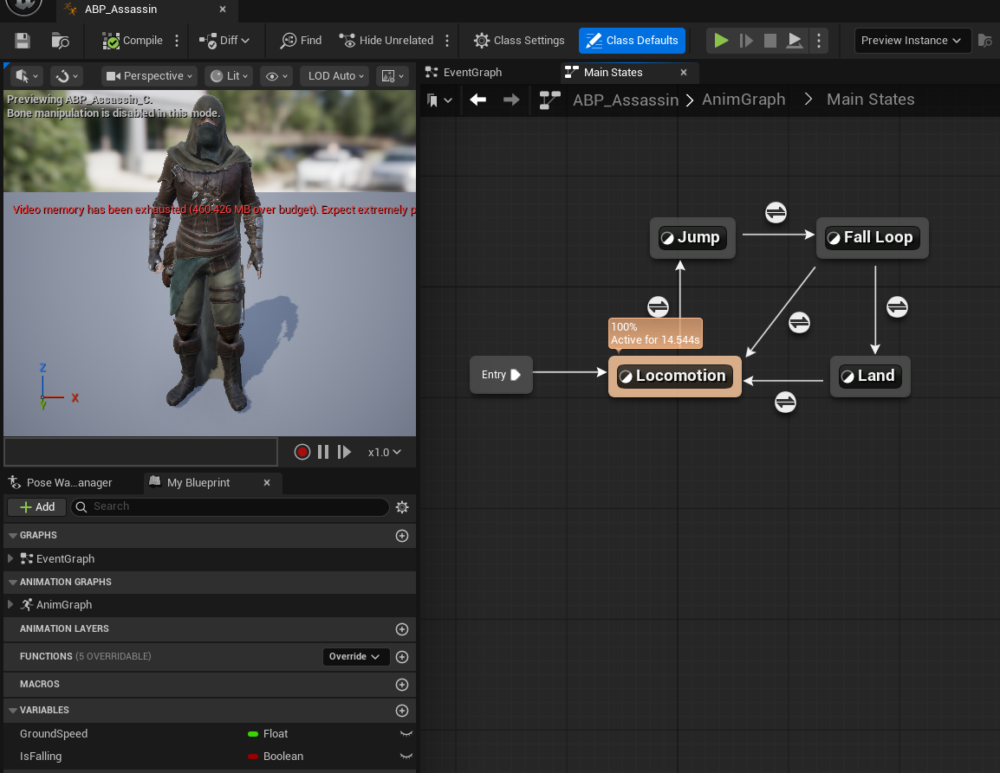
  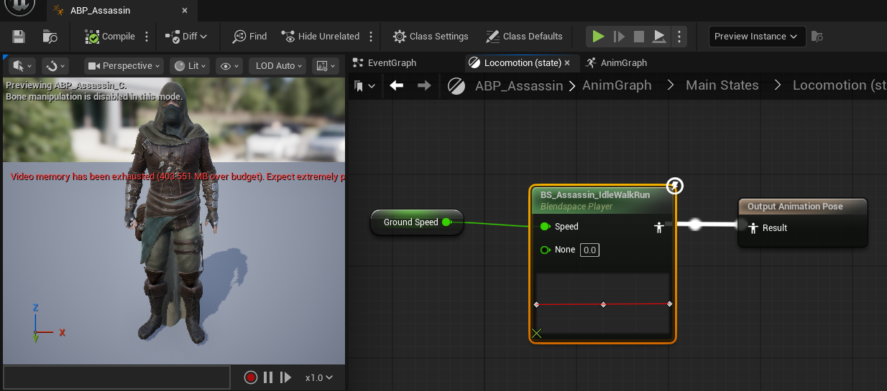
  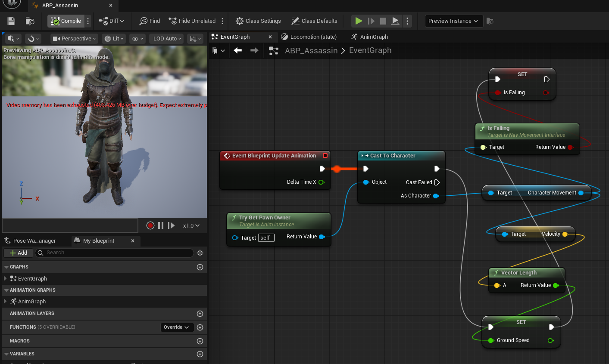

### Rendering and Materials
- **Materials**: Materials use proper sRGB / Linear color spaces and are NOT oversaturated by bloom. All assets on the scene have custom materials assigned.
- **Material Setups**: The project contains examples of 3 basic material setups: Opaque, Masked, and Translucent.
- **Screenshots**:
  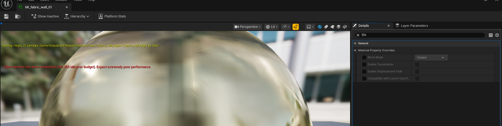
  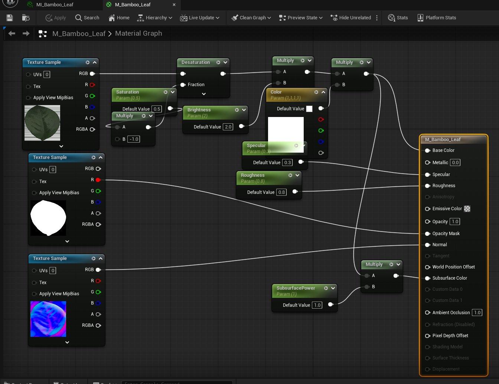
  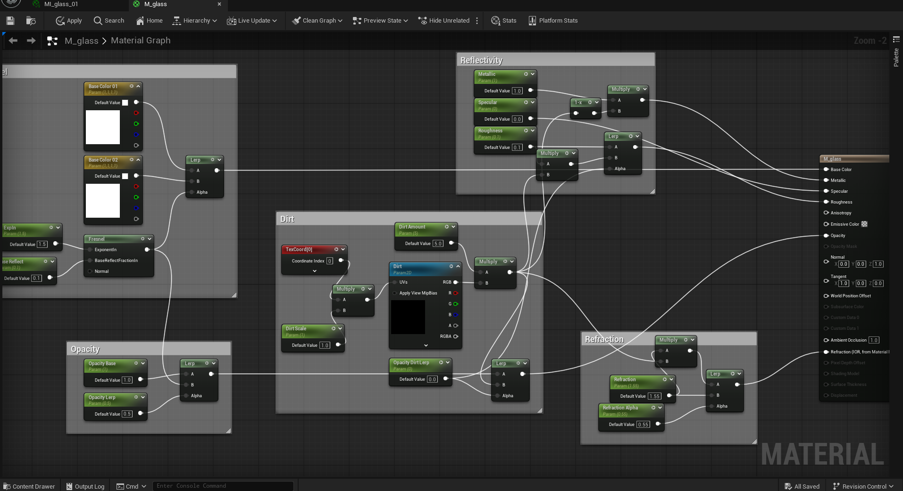

## 3. AI Disclosure
**Usage of AI Statement:**
A significant portion of the C++ codebase in the `Source/VaultView` folder was implemented and expanded with the assistance of AI (LLMs). 
While the foundational concepts, initial structures, and some specific scripts were adapted from the course conducted by Oleksandr Zimenko at PJATK, the code was heavily expanded using AI to meet all the advanced mandatory and additional project requirements.

AI was specifically utilized to:
1. Generate the implementation for the AI perception system, blackboard key assignments, and behavior tree controller bindings.
2. Implement the event-driven UI logic using dynamic multicast delegates.
3. Design and structure the `IDamageableInterface` and integrate it into both player and enemy classes.
4. Architect the Wave System, including enemy spawning logic, dynamic visibility updates, and camera fading transitions.
5. Provide detailed in-code documentation and comments to explain the logic and ensure code clarity.

All AI-generated or AI-assisted code segments have been clearly marked with an AI Disclosure comment block at the top of their respective source files. The developer fully understands the generated code and its integration into the Unreal Engine framework.